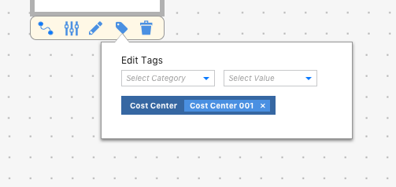
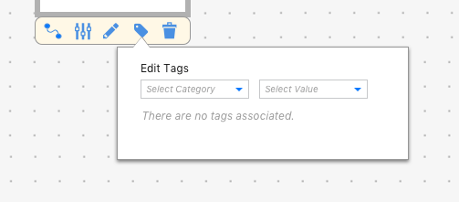
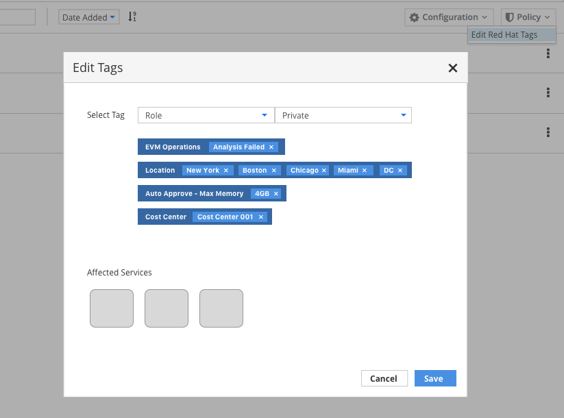
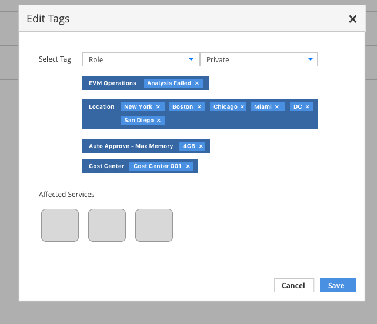

# Tags - Common Component
* Tags are used in multiple areas throughout the UI.
* Tags are made up of two parts, a category and value. Some categories allow for more than one value to be associated.  
* Tags can be applied to a single item or multiple items at one time depending on the use case.
* In all cases, the tag selection mechanism and tag labels should be visually consistent.
* As tags are added, they should be placed at the bottom of the list. Once saved, the tags should be reordered into alphabetic order so upon returning to the tags area, users can easily scan the list.

## Simple Tags
  *   

1. **Selection:**
* **Implementation Details:** Use the [Bootstrap Combobox](http://www.patternfly.org/pattern-library/widgets/#bootstrap-combobox) for the tag selection so users can either use the list presented or type to filter the list of options.
  * Once a category has been chosen, the value field should be enabled.

2. **Labels:**
  * Once the user selects a value from the list, the tag label should be added below the selection boxes.
  * The entire label should have a dark border with the category left aligned.
  * The value should be displayed to the right of the category, with a lighter border to distinguish it.
  * Each value should have an x icon right aligned to allow for removing it.

  *   
  * If the tag category only has one associated value, clicking the x on that value will remove the entire tag.  

3. **Multi-Value Tags:**   
  * **Implementation Details:** Use the [Bootstrap Multiple Select](http://www.patternfly.org/pattern-library/widgets/#bootstrap-select) for the value selection.
  * For categories that can have more than one value associated, the the multiple select widget will indicate values already selected.
  * Values can be removed by either deselecting items in the list or by clicking the x next to the tag.
  * Additional values are added to the right of the initial value and each has an x icon for removal.  

  *   

4. **Empty State:**
  * When there are no tags associated with an item, the empty state should show the following text: "There are no tags associated" in the area where tags would be added.

  *   

## Tagging Multiple Items

*   

* When tagging multiple items at once, there should be an additional section showing the items that will be affected by the changes.
* In the example shown, Services are being tagged, so the service icons would appear under the "Affected Services" label below all of the listed tags.
* In cases where a category has too many values associated with it, the darker blue background may wrap to the next line to accommodate for additional values.

*   
